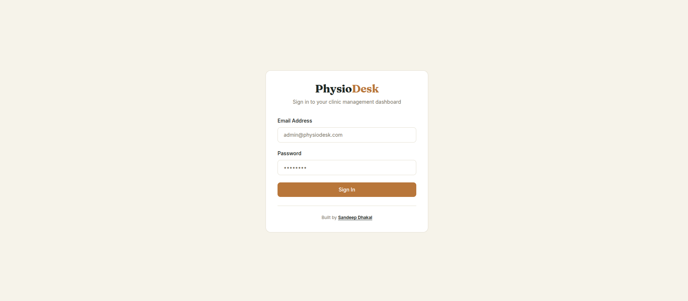
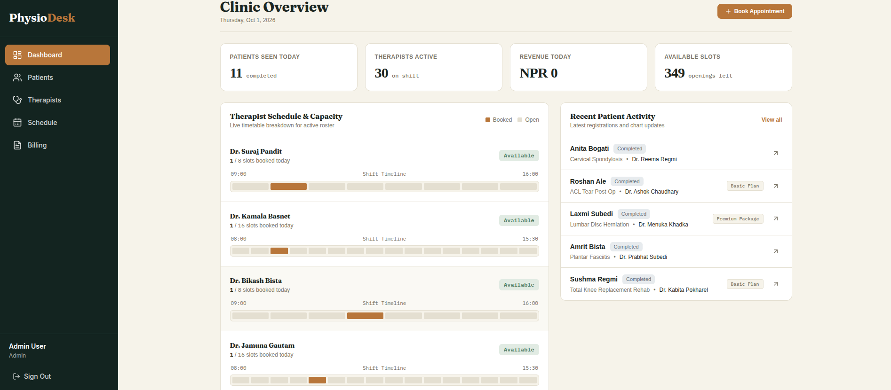
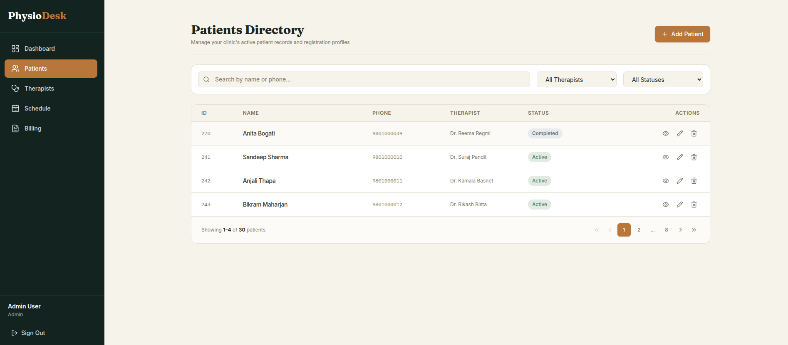
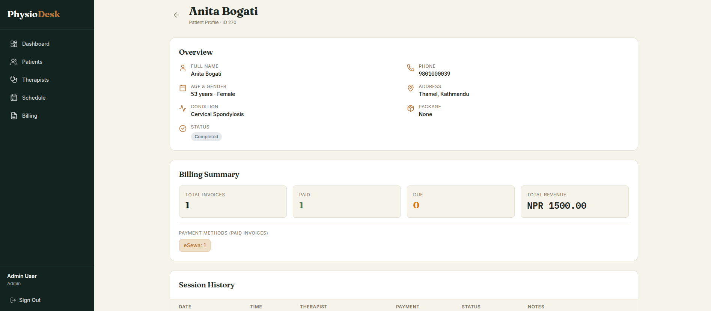
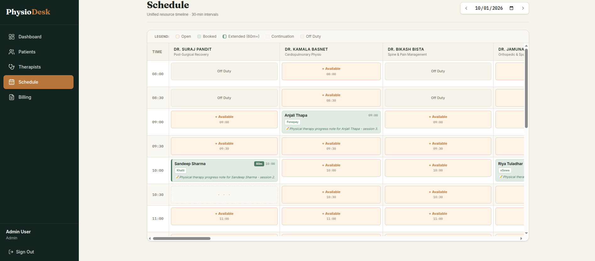
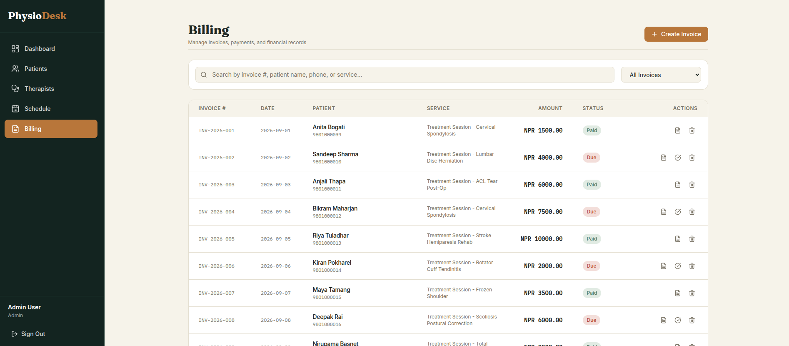
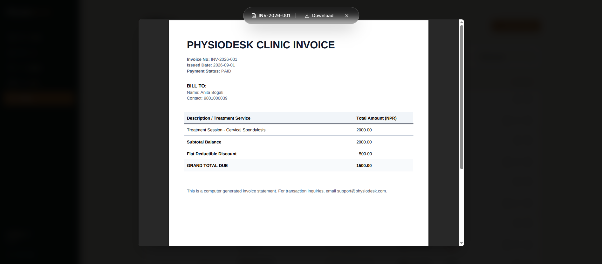
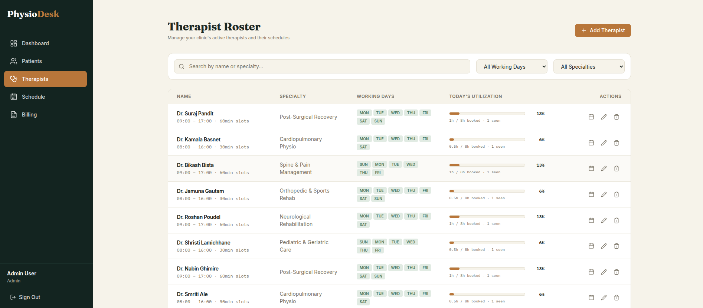

# PhysioDesk

A full-stack clinic management system for physiotherapy practices. Built with **FastAPI** (backend) and **Next.js** (frontend), backed by **PostgreSQL**.

## 🎥 Video Walkthrough


##  Live Demo

You can test the application live right now!

- **Frontend Application**: [https://physiodesk-frontend.onrender.com/](https://physiodesk-frontend.onrender.com/)
- **Backend API Docs**: [https://physiodesk-backend.onrender.com/api/docs](https://physiodesk-backend.onrender.com/api/docs)

>  **Note:** The application is hosted on Render's free tier. The first time you visit, the server may need to "wake up" (cold boot), which can take 1–2 minutes. Please be patient if the initial load seems slow!

---

## Tech Stack

| Layer | Technology |
| :--- | :--- |
| Backend | Python 3.11+, FastAPI, SQLModel (built on SQLAlchemy) |
| Frontend | Next.js 14 (App Router), React 18, TypeScript, Tailwind CSS |
| Database | PostgreSQL |
| ORM / Migrations | SQLModel for models + Alembic for migrations (configured to use SQLModel metadata) |
| Auth | PyJWT , bcrypt  |

---


## Docker Setup & Running 


### Prerequisites
- [Docker](https://www.docker.com/products/docker-desktop/) installed and running.
- [Docker Compose](https://docs.docker.com/compose/) (included with Docker Desktop).


```bash
docker compose up --build --no-cache -d

```

### Access the Application

| Service | URL |
| :--- | :--- |
| **Frontend Application** | [http://localhost:8080](http://localhost:8080) |
| **Backend API Docs** | [http://localhost:8080/api/docs](http://localhost:8080/api/docs) |


> **Note:** The backend container automatically waits for PostgreSQL to be healthy, runs Alembic migrations (`alembic upgrade head`), and executes `seeder.py`. Test users and mock data will be ready immediately.


## Test Login Credentials


| Role | Email | Password | Access Level |
| :--- | :--- | :--- | :--- |
| **Admin** | `admin@physiodesk.com` | `adminpassword123` | Full access  |
| **Staff** | `staff@physiodesk.com` | `staffpassword123` | no Therapist management, can book/reschedule |


##  Authentication & Authorization



### Requirements Coverage 

| Requirement | Status | Implementation |
|---|---|---|
| Email + password login with hashed passwords | ✅ | bcrypt with per-password salt |
| Token-based sessions (JWT) | ✅ | Dual access + refresh tokens, HS256 signed |
| 2+ roles enforced (not just UI-hidden) | ✅ | `require_admin` + `get_current_user` dependencies |
| All non-login routes require auth | ✅ | FastAPI dependency injection on every protected route |
| Frontend redirects to login when unauthenticated | ✅ | `ClientAppShell` guard + Axios interceptor logout |
|  Refresh-token rotation | ✅ | `RefreshTokenBlock` table + replay detection |
|  Logout-everywhere | ✅ | `/api/auth/logout-all` via `token_version` increment |

### Password Hashing
Passwords are hashed using **bcrypt** directly (`bcrypt.gensalt()` + `bcrypt.hashpw()`). Each password gets its own cryptographically-secure random salt, stored alongside the hash. On login, `bcrypt.checkpw()` recomputes the hash and performs a constant-time comparison to prevent timing attacks.

### Dual-Token JWT Sessions
- **Access token**: short-lived (configurable, default 15 min), sent as `Authorization: Bearer <token>` on every request.
- **Refresh token**: long-lived (7 days), used only to call `/api/auth/refresh`.
- Both tokens signed with **HS256** using a server-side secret.
- Refresh tokens carry a unique `jti` generated via `secrets.token_hex(16)`.
- Both tokens embed the user's current `token_version` in the payload.

### Role-Based Access Control (RBAC)
Roles are enforced **at the API dependency layer**, not just the UI:
- `get_current_user` — validates the JWT, checks `token_version`, returns the `User`. Any authenticated user (admin or staff) can access routes using this dependency.
- `require_admin` —The `require_admin` dependency wraps `get_current_user` and explicitly checks `current_user.role == "admin"`. If the check fails, FastAPI short-circuits the request and returns `403 Forbidden` before the route's business logic ever executes.


### Global Logout 
Each `User` has a `token_version` integer (default `1`), embedded in every JWT they receive. The logout endpoint increments this version in the database. The `get_current_user` dependency then rejects any incoming token whose embedded version doesn't match the current DB version — instantly invalidating every active session across every device, without needing an access-token blacklist.

### Refresh Token Rotation & Replay Prevention
Every refresh token has a unique `jti`. On `/api/auth/refresh`:
1. Backend decodes the token and extracts `jti`, `version`, and `sub`.
2. Checks that the token's `version` matches the user's current `token_version` (mismatch = session revoked globally).
3. Looks up the `jti` in the `RefreshTokenBlock` table:
   - **Not found** → legitimate. The `jti` is inserted into the blocklist, and a fresh access+refresh pair is issued. The old refresh token is now dead.
   - **Already found** → replay attack (someone is reusing a stolen token). Backend immediately increments `user.token_version` (triggering a global logout) and returns `400 Security breach detected`.

### Frontend Silent Refresh Queue
When the access token expires, multiple concurrent API calls can fail with `401` simultaneously. The Axios interceptor uses an `isRefreshing` flag and a `waitingRequests` queue:
- First `401` → sets `isRefreshing = true`, calls `/api/auth/refresh`.
- Subsequent `401`s → pushed into the queue (no duplicate refresh calls).
- Refresh succeeds → all queued requests are resolved with the new token and retried automatically.
- Refresh fails → `localStorage` is cleared and the user is redirected to `/login`.

---

## Dashboard Module


### 1. Requirements Compliance Table

| Requirement | Status | Implementation |
|---|---|---|
| Show live, computed stats (not hardcoded) | ✅ | `GET /api/dashboard/stats` dynamically queries the database for today's metrics across multiple tables. |
| Patients seen today | ✅ | Computed by counting today's appointments with status `"Completed"` or `"Booked"`. |
| Therapists on duty today | ✅ | Computed by filtering active therapists who are not on a `ScheduleOverride` day off and whose working days include today. |
| Revenue collected today | ✅ | Computed by summing `total_amount` of invoices created today with a `"paid"` status. |
| Open slots remaining today | ✅ | Dynamically calculated by iterating through each on-duty therapist's available time blocks minus existing bookings. |
| Therapist capacity view (booked vs. free slots) | ✅ | Returns a `therapist_capacity_grid` containing a `visual_slots_timeline` array mapping each slot's status (`"booked"` or `"free"`). |
| Recent patients (last N added with details) | ✅ | Queries the latest patients (default `limit=5`) and enriches the response with their assigned therapist's name, condition, package, and status. |

### 2. Assumptions Made

- **Revenue Calculation Logic**: The implementation calculates "revenue collected today" by summing invoices where `created_at == today_str` and `status == "paid"`. It assumes that for this clinic's workflow, the invoice creation date and payment collection date are closely aligned, or that historical paid invoices are not retroactively added to "today's" revenue metric. (A dedicated `paid_at` timestamp would be more precise for strict accounting).
- **"Patients Seen Today" Definition**: The metric counts appointments marked as either `"Completed"` or `"Booked"` for the current day. This assumes that a "Booked" appointment for today counts toward the daily workload metric, even if the session hasn't technically concluded yet.
- **N+1 Query Tolerance**: The recent patients enrichment uses sequential `session.get(Therapist, id)` calls within a loop. This is assumed to be acceptable and performant given the strictly limited payload size (`limit=5`), avoiding the complexity of a bulk join for a trivial number of records.
- **Slot Generation**: The `visual_slots_timeline` is generated purely in Python using `timedelta` based on the therapist's `slot_duration`. It assumes the frontend will render this array directly as a visual grid or progress bar without needing further backend time-math.

### 3. Implementation Details

- **Unified Aggregation Endpoint**: Instead of forcing the frontend to make 4-5 separate API calls to assemble the dashboard, the `api/dashboard/stats` endpoint acts as a powerful aggregation layer. It fetches therapists, appointments, and invoices for the current date in broad queries, then processes the relationships in memory for maximum responsiveness.
- **Dynamic Override Integration**: The capacity calculation seamlessly respects `ScheduleOverride` records. If a therapist has a custom start/end time or is marked as a day off for the current date, the timeline generation adjusts or skips the therapist entirely, ensuring the dashboard reflects *actual* daily reality, not just baseline schedules.
- **Data Enrichment for UI Readiness**: The `recent_patients` payload transforms raw foreign keys (`assigned_therapist_id`) into human-readable strings (`assigned_therapist_name`). This "Backend-for-Frontend" (BFF) pattern ensures the Next.js client can render the recent activity list immediately without needing to resolve therapist IDs client-side.
- **Strict Status Filtering**: Revenue calculation explicitly checks `inv.status.lower() == "paid"`, ensuring that "Due" or "Cancelled" invoices do not artificially inflate the daily revenue metric.

## Patients  Module



### 1. Requirements Compliance Table

| Requirement | Status | Implementation |
|---|---|---|
| Create patient (demographics, condition, assignment, package) | ✅ | `POST /api/patients` with strict Pydantic validation (Nepali phone regex, age limits, status enums). |
| Read list with search & filter | ✅ | `GET /api/patients` supports combined search (name OR phone), filters (therapist, status), and server-side pagination. |
| Update patient details | ✅ | `PUT /api/patients/{id}` allows partial updates while validating foreign key constraints (therapist existence). |
| Delete patient | ✅ | `DELETE /api/patients/{id}` performs a hard delete (purges record from DB). |
| Patient Profile: Overview | ✅ | `GET /api/patients/{id}` returns the core patient record. |
| Patient Profile: Session History | ✅ | `GET /api/patients/{id}/sessions` returns a chronological list of appointments with enriched therapist names. |


### 2. Assumptions Made

- **Hard Deletion Strategy**: The implementation uses hard deletes (`session.delete`) for patients. This assumes that when a patient is "removed," their data should be permanently purged from the system, potentially prioritizing data privacy (e.g., "right to be forgotten") over long-term historical retention in this specific module.
- **Billing-Scheduling Coupling**: The "Billing History" is derived directly from `Appointment` records (tracking `payment_method` and `status`) rather than a separate `Invoice` entity. Consequently, the profile view shows a summary of *sessions paid* (e.g., "5 Cash, 2 Card") rather than a list of specific invoice amounts, as the `Appointment` model in this scope does not carry a monetary `amount` field.
- **Localization (Nepal)**: Phone number validation is strictly enforced for Nepali formats (`98xxxxxxxx`, `97xxxxxxxx`, `01xxxxxxx`) via Regex, assuming the clinic's primary operational region.
- **Pagination Strategy**: Implemented server-side pagination (default 4 items per page, max 100) to optimize frontend grid rendering and reduce payload size for large patient directories.

### 3. Implementation Details

- **Advanced Search Logic**: The list endpoint utilizes SQLModel's `or_` operator to allow a single search input to query both `name` and `phone` fields simultaneously (`Patient.name.contains(...) | Patient.phone.contains(...)`), improving UX for receptionists who may search by either.
- **Data Enrichment**: The `get_patient_sessions` endpoint performs an in-memory join (or sequential lookup) to attach the `Therapist.name` to each appointment record. This ensures the frontend receives human-readable data ("Dr. Smith") instead of just foreign keys (`therapist_id: 4`).
- **Validation Layer**: Heavily relies on Pydantic `field_validator` to enforce business rules at the API boundary. This includes:
    - **Regex Validation**: Ensures phone numbers match specific local formats.
    - **Enum Enforcement**: Restricts `status` to specific tags ("Active", "Completed", "On hold") to maintain consistency with the frontend's color-coded status pills.
    - **Range Checks**: Enforces logical constraints like `1 <= age <= 120`.


## Scheduling Module


### 1. Requirements Compliance Table

| Requirement | Status | Implementation |
|---|---|---|
| Calendar/grid view (therapists as columns, time slots as rows, selectable date) | ✅ | `GET /api/schedule/grid` returns a `UnifiedCalendarGrid` with `master_time_slots` (rows) and `therapist_columns` (columns) for any given date. |
| Cell shows: open, booked (with patient name), or therapist-off | ✅ | `GridCellDetail` schema enforces strict status tags: `"open"`, `"booked"`, `"therapist-off"`, and `"continuation"` for multi-slot appointments. |
| Book appointment (patient, therapist, date, time slot, payment method, notes) | ✅ | `POST /api/schedule` accepts a validated payload containing all required fields and persists the `Appointment` record. |
| Respect therapist's actual availability (no double-booking) | ✅ | Booking logic checks `_is_available`, verifies the appointment fits within working hours, and iterates through required time blocks to prevent overlapping "Booked" appointments. |
| Clicking a booked slot shows details and allows reschedule | ✅ | `PUT /api/schedule/{appointment_id}` accepts a `ReschedulePayload` (date, time_slot) and re-runs all availability and collision checks before updating the record. |

### 2. Assumptions Made

- **Master Time Interval**: Assumed a fixed `MASTER_INTERVAL_MINUTES = 30` for the calendar grid. This standardizes the UI rendering. If a therapist has a 60-minute `slot_duration`, the first slot is marked `"booked"` and the subsequent 30-minute block is marked `"continuation"` to visually block the time without breaking the grid.
- **Appointment Cancellation**: "Deleting" an appointment is implemented as a soft delete (setting `status = "Cancelled"`). This preserves historical data for patient profiles, therapist utilization metrics, and potential billing records.
- **Rescheduling Scope**: The `ReschedulePayload` only accepts `date` and `time_slot`. It is assumed that rescheduling an appointment does not change the patient, therapist, payment method, or notes.
- **Past Date Prevention**: Explicitly blocked booking or rescheduling appointments for any date prior to the current day to maintain logical data integrity.

### 3. Implementation Details

- **Dynamic Grid Generation Algorithm**: The `GET /api/schedule/grid` endpoint acts as a powerful aggregation layer. It first calculates the global earliest start and latest end times across *all* active therapists to build a unified `master_time_slots` array. It then iterates through each therapist and time slot, cross-referencing `ScheduleOverride` records and existing `Appointment` data to assign the correct UI status (`open`, `booked`, `continuation`, or `therapist-off`).
- **Robust Double-Booking Prevention**: The booking (`POST`) and rescheduling (`PUT`) endpoints do not just check the requested start time. They calculate `slots_to_check` based on `therapist.slot_duration // MASTER_INTERVAL_MINUTES`. A loop iterates through each 30-minute block of the appointment to ensure no overlapping `"Booked"` appointments exist for that therapist on that date.
- **Seamless Override Integration**: Helper functions (`_is_available`, `_get_working_hours`) intelligently blend a therapist's base schedule (`working_days`, `start_time`, `end_time`) with any date-specific `ScheduleOverride`. This ensures that booking logic automatically respects custom hours or days off without requiring separate code paths.
- **Data Integrity Guards**: 
  - Prevents booking appointments that would spill over a therapist's working end time (`_appointment_fits_in_working_hours`).
  - Prevents booking or rescheduling into the past.
  - Ensures the referenced `patient_id` and `therapist_id` exist and the therapist is currently active.


## Billing Module



### 1. Requirements Compliance Table

| Requirement | Status | Implementation |
|---|---|---|
| Create invoice (service/package, discount, status, payment method) | ✅ | `POST /api/billing` accepts invoice payload, auto-generates an invoice number if missing, and enforces `total_amount = max(0.0, subtotal - discount)`. |
| Read list of invoices with status filtering | ✅ | `GET /api/billing` supports optional `status` query parameter and enriches the response with patient name and phone details. |
| Update invoice (e.g., mark Due as Paid) | ✅ | `PUT /api/billing/{id}` allows partial updates (like changing status) and recalculates the total amount to ensure data integrity. |
| Delete/Void invoice | ✅ | `DELETE /api/billing/{id}` removes the invoice record from the financial logs. |
| **Bonus:** Printable/exportable invoice view | ✅ | `GET /api/billing/{id}/download-pdf` dynamically generates a professionally styled, branded PDF invoice using `reportlab`. |

### 2. Assumptions Made

- **Admin-Only Access**: All billing endpoints are strictly protected by the `require_admin` dependency. This aligns with the spec's suggestion that Staff/Receptionists should have no access (or strictly read-only) to billing and therapist management.
- **Hard Deletion for Voided Invoices**: The `void_invoice` endpoint performs a hard delete (`session.delete`). This assumes that "voiding" in this specific scope means complete removal from the active financial logs, rather than maintaining a soft-deleted "Voided" status for audit trails.
- **Auto-Generated Invoice Numbers**: If the client does not provide an `invoice_number`, the backend auto-generates one in the format `INV-{YEAR}-{RANDOM_4_DIGITS}` to guarantee uniqueness and proper formatting.
- **Backend Financial Enforcement**: The backend explicitly recalculates `total_amount = max(0.0, subtotal - discount)` on both creation and update. This prevents any client-side manipulation from resulting in negative invoice totals.
- **PDF Generation Tooling**: Used the `reportlab` library for server-side PDF generation to fulfill the bonus requirement, ensuring the output is a real, downloadable file rather than just a frontend print stylesheet.

### 3. Implementation Details

- **Data Enrichment on Read**: The `list_invoices` endpoint performs an efficient in-memory lookup to attach the associated `Patient` details (name, phone) to each invoice record. This "Backend-for-Frontend" (BFF) approach prevents the Next.js client from having to make N+1 API calls to resolve patient names for the invoice table.
- **Dynamic PDF Generation**: The `/download-pdf` endpoint constructs a `SimpleDocTemplate` using `reportlab`. It applies custom `ParagraphStyle` and `TableStyle` configurations to match a professional clinic aesthetic, including a clear financial breakdown (Subtotal, Flat Deductible Discount, Grand Total Due) and clinic branding.
- **Robust Business Logic Guards**: 
  - Validates that the target `patient_id` exists before allowing invoice creation.
  - Ensures `total_amount` can never drop below `0.0`, regardless of the discount value provided.
  - Auto-populates the `created_at` date with the current server date if omitted, ensuring consistent temporal tracking.
- **Strict RBAC Enforcement**: Every route in this module (`POST`, `GET`, `PUT`, `DELETE`, and PDF download) is guarded by `Depends(require_admin)`, ensuring absolute role-based access control at the API dependency layer.


## Therapists Module


### 1. Requirements Compliance Table

| Requirement | Status | Implementation |
|---|---|---|
| Full CRUD restricted to Admin | ✅ | `require_admin` dependency enforced on `POST`, `PUT`, and `DELETE` endpoints. |
| Create therapist (name, specialty, working days, start/end time, slot duration) | ✅ | `POST /api/therapists` with strict Pydantic validation. Prevents duplicate active names via case-insensitive check. |
| Read roster (specialty, weekly hours, patients seen today) | ✅ | `GET /api/therapists` returns a dynamically computed roster including daily capacity, booked hours, utilization %, and patients seen today. Accessible to all authenticated users. |
| Update therapist details and schedule | ✅ | `PUT /api/therapists/{id}` allows partial updates. Blocks `slot_duration` changes if active appointments exist to prevent data integrity issues. |
| Delete therapist (handle existing appointments) | ✅ | `DELETE /api/therapists/{id}` performs a soft delete (`is_active = False`). Existing appointments remain intact for historical/billing purposes. |
| Override/assign schedule for specific date (day off, custom hours) | ✅ | `POST /api/therapists/override` allows setting a day off or custom start/end times. Blocks day-off overrides if booked appointments exist for that date. |

### 2. Assumptions Made

- **Soft Deletes for Therapists**: When a therapist is deleted, they are marked as `is_active = False` rather than hard-deleted from the database. This preserves historical data for past appointments, billing records, and patient histories without breaking foreign key constraints.
- **Slot Duration Changes**: Changing a therapist's `slot_duration` is blocked if they have existing "Booked" or "Completed" appointments. This prevents breaking the time-grid logic and duration calculations for existing schedules.
- **Working Days Storage**: `working_days` is stored as a comma-separated string (e.g., `"Monday,Wednesday,Friday"`) rather than a separate relational join table. This keeps the schema simple and optimizes read performance for the roster view.
- **Override Permissions**: The schedule override endpoint is accessible to any authenticated user (`get_current_user`), not just admins. This allows receptionists/staff to manage daily schedule adjustments (like a therapist calling in sick) without needing full administrative rights.
- **Standardized Slot Durations**: Slot durations are strictly restricted to `30` or `60` minutes via Pydantic validation to simplify the frontend scheduling grid generation logic.

### 3. Implementation Details

- **Data Modeling**: The module utilizes two SQLModel tables: `Therapist` for core profile and baseline schedule data, and `ScheduleOverride` for date-specific exceptions. A soft-delete flag (`is_active`) is used on the `Therapist` model to handle deletions safely.
- **Dynamic Roster Computation**: The `GET /api/therapists` endpoint acts as an aggregation layer. It doesn't just return raw DB rows; it dynamically computes `daily_capacity_hours`, `booked_hours_today`, and `utilization_today_percent` by querying the `Appointment` and `ScheduleOverride` tables for the current date and calculating the metrics in Python.
- **Strict Pydantic Validation**: Heavy use of Pydantic `field_validator` and `model_validator` ensures data integrity at the API boundary. It validates that working days are valid weekdays, times are in `HH:MM` 24-hour format, end time is strictly after start time, and shifts do not exceed 12 hours.
- **Data Integrity Guards**: 
  - Prevents creating duplicate active therapists (case-insensitive name check).
  - Prevents changing `slot_duration` if the therapist has any non-cancelled appointments.
  - Prevents marking a therapist as "Day Off" via override if they already have "Booked" appointments for that specific date, forcing the user to reschedule/cancel first.


## Key Assumptions & Design Decisions

Per the instructions to handle ambiguity, the following assumptions were made and documented:

1. **Therapist Deletion Strategy**: Soft delete (`is_active = False`) to preserve historical appointment and billing data without breaking foreign key constraints.
2. **Patient Deletion Strategy**: Hard delete (`session.delete`), assuming the clinic prioritizes data privacy ("right to be forgotten") over long-term historical retention for patient profiles.
3. **Revenue Calculation**: "Revenue collected today" sums invoices where `created_at == today` and `status == "paid"`. Assumes invoice creation and payment collection are closely aligned.
4. **Slot Duration Constraints**: Restricted to `30` or `60` minutes via Pydantic validation to simplify frontend scheduling grid generation and prevent fractional hour complexities.
5. **Localization**: Phone number validation enforced for Nepali formats (`98xxxxxxxx`, `97xxxxxxxx`, `01xxxxxxx`) via Regex, matching the clinic's operational region.

---

##  What I Would Do Differently With More Time

Given the 5–7 day time budget, scoping was prioritized to ensure core features were robust. With more time, I would add:

1. **Comprehensive Test Suite**: Implement  integration tests for core business logic (double-booking prevention, refresh token replay detection, RBAC dependency behavior) to ensure long-term stability and prevent regressions.
2. **Strict Accounting Timestamps**: Add a dedicated `paid_at` timestamp to the `Invoice` model. Currently, "revenue collected today" relies on `created_at`, but a dedicated payment timestamp is more accurate for strict financial auditing.
3. **Audit Logging**: Track who created/modified patient records, appointments, and invoices with timestamps for compliance and accountability.


